## [pscweb2](../index.md) > [Help](index.md)

# ページごとの説明

## ログイン

ログイン方法は現在、Twitter 認証のみです。

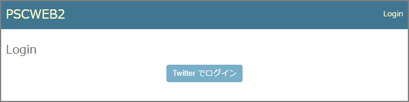

- 「Twitter でログイン」を押します。
- ログインすると、「参加している公演」を表示します。

## 参加している公演

自分が参加している公演の一覧を表示します。

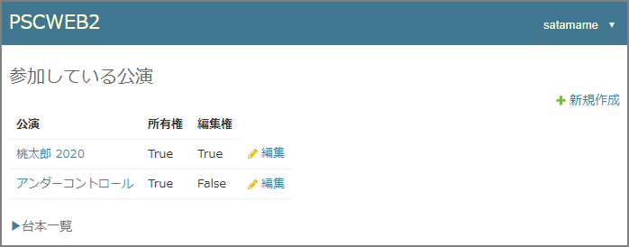

- 「新規作成」を押すと、新しく公演を作れます。
    - 作った人に「所有権」が与えられます。
- 各行の公演名を押すと、その公演のトップ画面になります。
- 所有権を持っている公演には「編集」が表示されます。
- 「編集」を押すと、公演名を変更できます。
    - 編集画面から公演を削除できます。
- 「台本一覧」を押すと、[「台本一覧」](#台本一覧)を表示します。

## 公演のトップ画面

公演ごとのトップ画面です。
ここから各機能にアクセスできます。

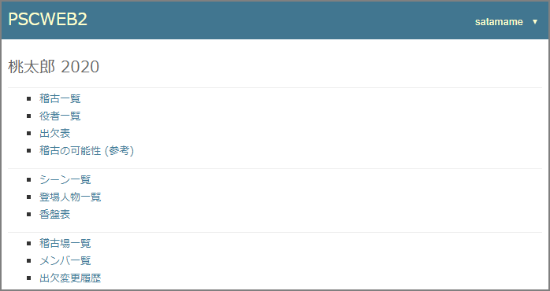

## 稽古一覧

公演ごとの稽古の一覧を表示します。

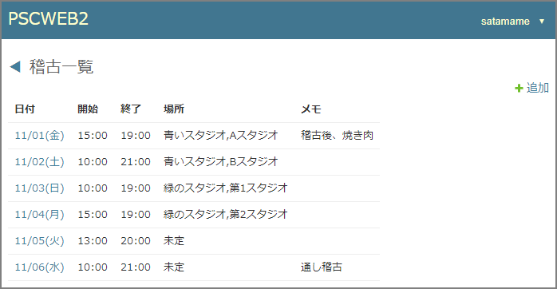

- 公演の所有権または編集権があると「追加」が表示されます。
- 「追加」を押すと、新しく稽古を作れます。
    - 稽古場を設定するには、稽古場を登録しておく必要があります ([> 稽古場一覧](#稽古場一覧))。
- 各行の日付を押すと、その稽古の詳細を表示します。

## 稽古の詳細

稽古の詳細を表示します。

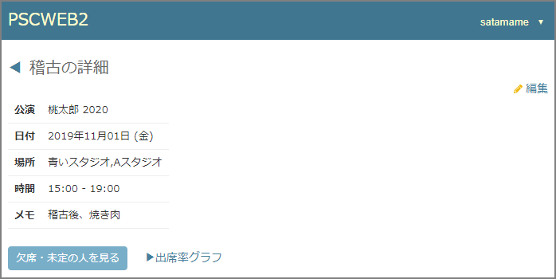

- 公演の所有権または編集権があると「編集」が表示されます。
- 「編集」を押すと、稽古を編集できます。
    - 編集画面から稽古を削除できます。
- 「出欠・未定の人を見る」を押すと、欠席の人、部分参加の人、予定を記入していない人のリストをパネルで表示します。
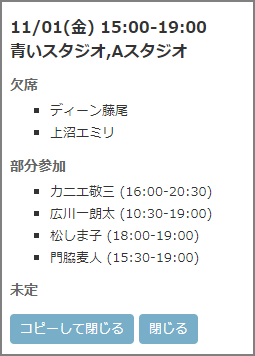
    - このパネルで「コピーして閉じる」を押すと、情報がクリップボードにコピーされます。
- 「出席率グラフ」を押すと、この稽古の出席率をシーンごと・時間帯ごとに表示します ([> 出席率グラフ](#出席率グラフ))。

## 役者一覧

公演ごとの役者の一覧を表示します。

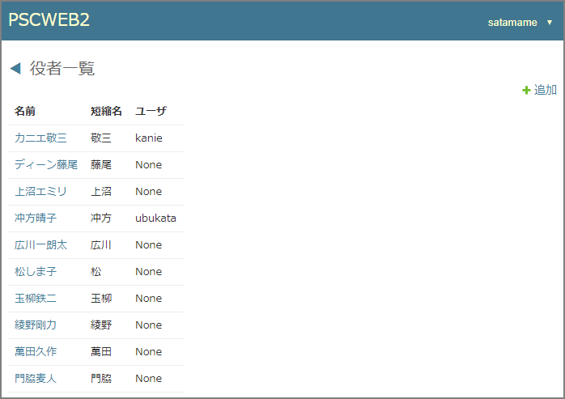

- 公演の所有権または編集権があると「追加」が表示されます。
- 「追加」を押すと、新しく役者を作れます。
    - 役者はただのデータですが、公演に参加しているユーザと関連付けることもできます。
- 各行の名前を押すと、その役者の詳細を表示します。

## 役者の詳細

役者の詳細と、稽古ごとの参加時間を表示します。

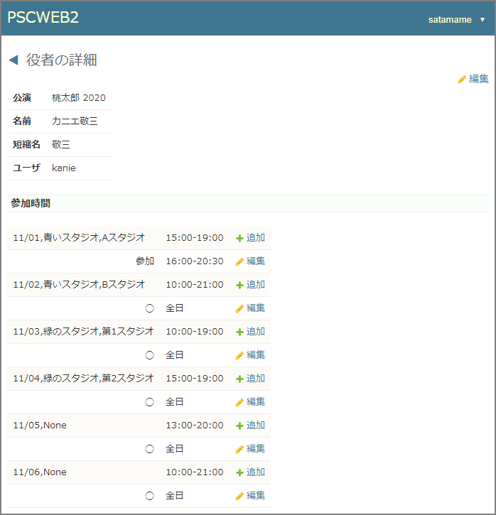

- 公演の所有権または編集権があると「編集」が表示されます。
- 「編集」を押すと、役者を編集できます。
    - 編集画面から役者を削除できます。
- 公演の所有権または編集権があるか、この役者に関連付けられたユーザなら、稽古ごとの参加時間を追加/編集/削除できます。

## 出欠表

すべての稽古の、すべての役者の出欠を表示します。

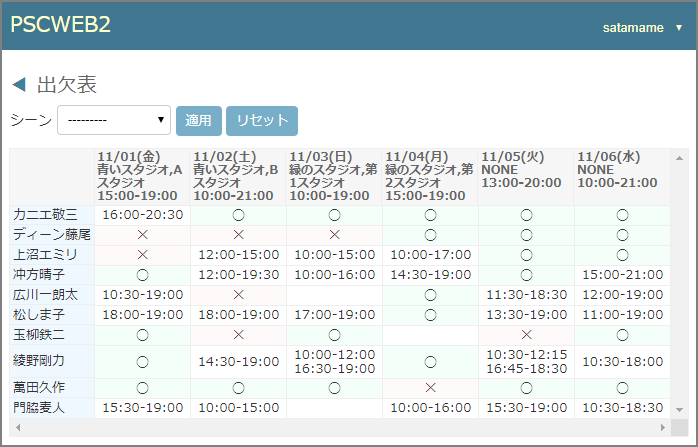

- シーンを選択して「適用」を押すと、そのシーンに出ている役者のみ表示されます。
- 稽古のヘッダを押すと、その稽古の出席率をシーンごと・時間帯ごとに表示します ([> 出席率グラフ](#出席率グラフ))。

## 出席率グラフ

「出欠表」のヘッダを押すと表示されます。
稽古ごとの出欠状況を、参加者の出入りで分割した時間帯ごとに、色と数値で可視化します。

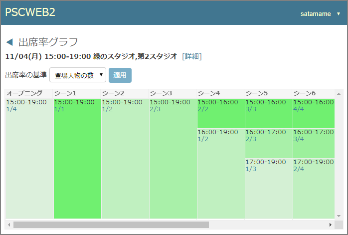

- 数値を押すと、その時間帯にいる役者といない役者のリストをパネルで表示します。
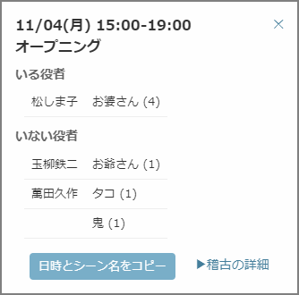
    - このパネルで「日時とシーン名をコピー」を押して、予定表などにペーストできます。

### 数値の意味

「出席率の基準」によって表示が変わります。

### 出席率の基準

- 登場人物の数
    - そのシーンの登場人物のうち、何人が出席しているか。
- 役者の数
    - そのシーンに出ている役者のうち、何人が出席しているか。
- セリフ数
    - シーンの全セリフ数に対して、出席者の合計セリフ数がいくつか。

## 稽古の可能性 (参考)

すべての稽古について、各シーンがどれくらい稽古できるかを色と数値で俯瞰します。
これは実験的な機能です。表示に時間がかかります。

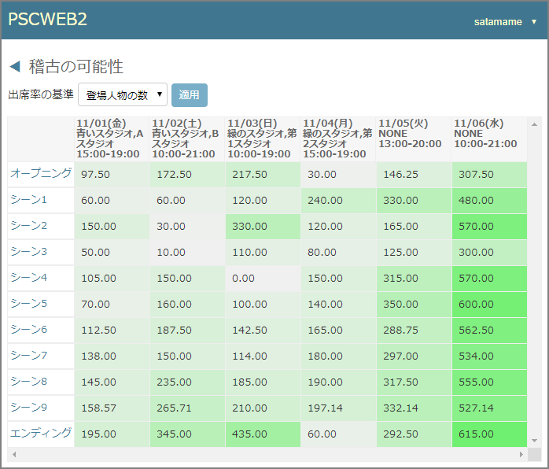

### 数値の意味

先に[「出席率グラフ」](#出席率グラフ)を見ると分かりますが、一回の稽古を参加者の出入りによって分割しています。
表示している数値は、この分割された時間帯ごとの以下の式の値の合計です。

- 式 = 時間帯の長さ (分) × シーンの出席率 ÷ シーンの長さ

### 出席率の基準

「出席率の基準」によって、上の式の「シーンの出席率」が変わります。

- 登場人物の数
    - そのシーンの登場人物のうち、何人が出席しているか。
- 役者の数
    - そのシーンに出ている役者のうち、何人が出席しているか。
- セリフ数
    - シーンの全セリフ数に対して、出席者の合計セリフ数がいくつか。

## シーン一覧

公演ごとのシーンの一覧を表示します。

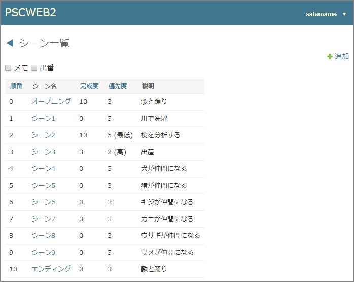

- 公演の所有権または編集権があると「追加」が表示されます。
- 「追加」を押すと、新しくシーンを作れます。
- 各行のシーン名を押すと、そのシーンの詳細を表示します。

## シーンの詳細

シーンの詳細を表示します。

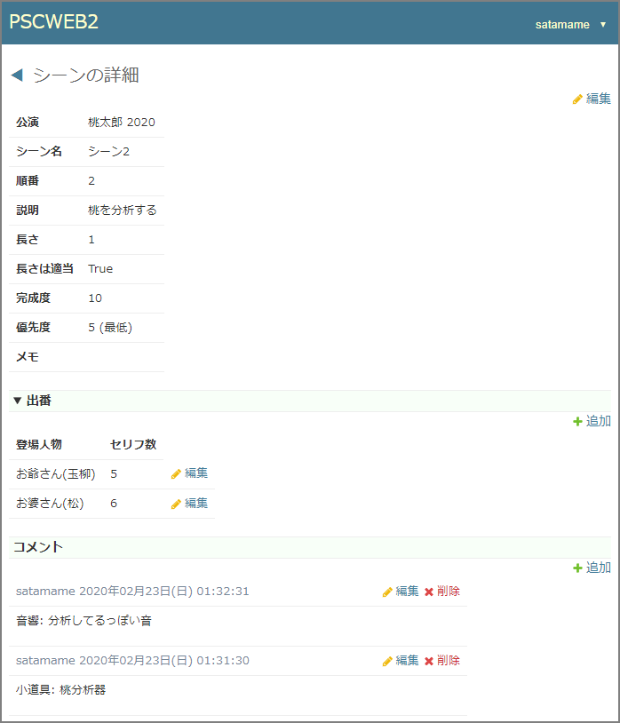

- 公演の所有権または編集権があると「編集」が表示されます。
- 「編集」を押すと、シーンを編集できます。
    - 編集画面からシーンを削除できます。

### 出番

「出番」を押すと、出番のある登場人物を表示します。

- 公演の所有権または編集権があると、出番を追加・編集・削除することができます。
- 「長さは適当」というスイッチは、今は機能していません。
    - 予定では「稽古の可能性」画面で、シーンの「長さ」の値を無視して計算することを考えてました。

### コメント

自由にコメントを追加できます。

- 公演の所有権または編集権があるか、このコメントを記入したユーザなら、コメントを編集/削除できます。

## 登場人物一覧

公演ごとの登場人物の一覧を表示します。

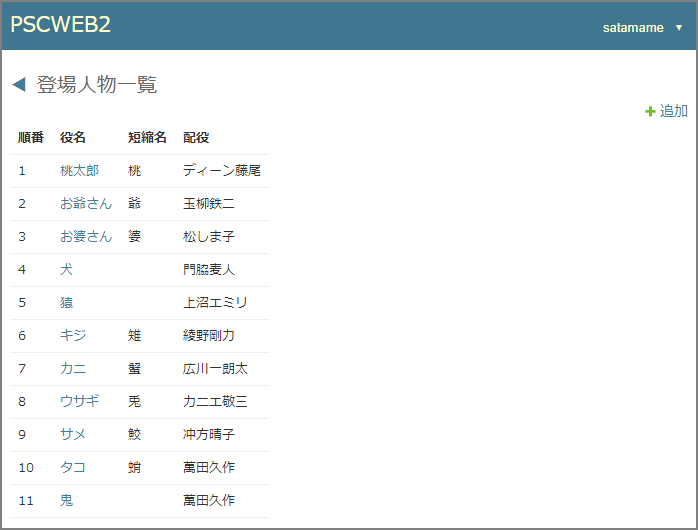

- 公演の所有権または編集権があると「追加」が表示されます。
- 「追加」を押すと、新しく登場人物を作れます。
- 各行の役名を押すと、その登場人物の詳細を表示します。

## 登場人物の詳細

登場人物の詳細を表示します。

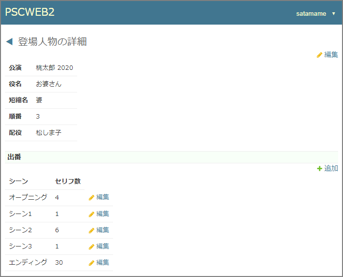

- 公演の所有権または編集権があると「編集」が表示されます。
- 「編集」を押すと、登場人物を編集できます。
    - 編集画面から登場人物を削除できます。

### 出番

出番のあるシーンを表示します。

- 公演の所有権または編集権があると、出番を追加・編集・削除することができます。
- セリフ数を「自動」(セリフ数を決めない) にすると、出席率を計算する時に、そのシーンの平均セリフ数を使うようになります。

## 香盤表

公演ごとの香盤表を表示します。

- シーン名を押すと、そのシーンのセリフ数で列がソートされます。

### 「シーン名」フィルタ

シーン名を部分一致でフィルタします。
フィルタを適用するには「適用」を押します。

- スペース区切りで AND 検索ができます。
- 各ワードの前にマイナス (-) をつけると、NOT になります。
例
    - "シーン -3 -6" : "シーン" を含んで "3" も "6" も含まないシーン名にマッチ。

### 「役者」チェックボックス

登場人物でなく役者で表示します。

- 複数の役を演じる役者は、役の合計のセリフ数が表示されます。

## 稽古場一覧

公演ごとの稽古場の一覧を表示します。
稽古場は「施設」と「部屋」という2段構造になっています。

- 公演の所有権または編集権があると「施設を追加」が表示されます。
- 「施設を追加」を押すと、新しく稽古施設を作れます。
- 公演の所有権または編集権があると、施設に部屋を追加したり、施設や部屋を編集したりできます。
    - 施設や部屋の編集画面では、施設や部屋を削除できます。

## メンバ一覧

公演に参加しているメンバの一覧を表示します。

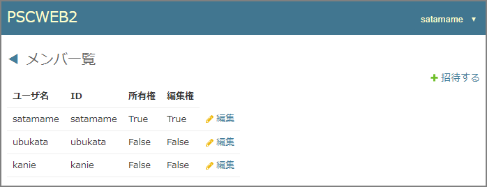

- 公演の所有権があると「招待する」が表示されます。
- 「招待する」を押すと、ユーザをその公演の座組に招待できます。
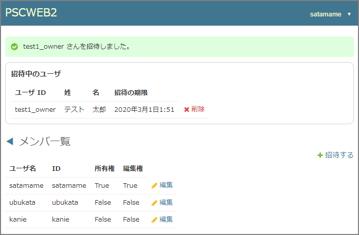
    - 招待されたユーザの「参加している公演」画面に通知が表示されます。  

- 公演の所有権があると、各行に「編集」が表示されます。
    - 「編集」を押すと、メンバの「編集権」を変更できます。

## 出欠変更履歴

「役者の詳細」で変更できる「稽古ごとの参加時間」を、いつ、誰が変更したかを表示します。

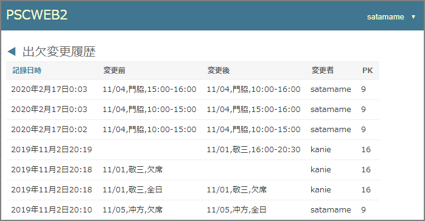

- 現在、この履歴は削除できません。

## 台本一覧

自分が作成した台本と、公開されている台本の一覧を表示します。

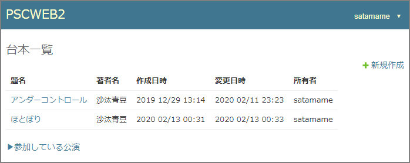

- 「新規作成」を押すと、新しく台本を作れます。
    - 作った人に「所有権」が与えられます。
- 各行の題名を押すと、その台本の詳細を表示します。

## 台本の詳細

台本の詳細を表示します。

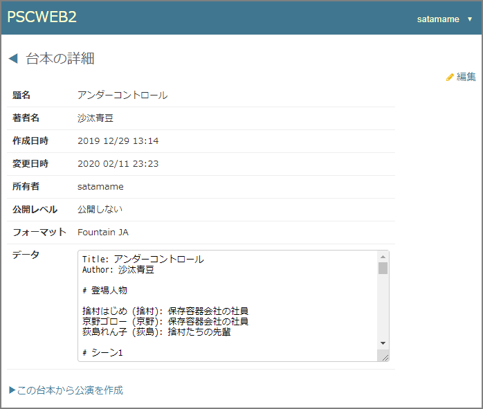

- 台本の所有権があると「編集」が表示されます。
- 「編集」を押すと、台本を編集できます。
    - 編集画面から台本を削除できます。
- 「この台本から公演を作成」を押すと、公演を作成できます。
    - シーン、登場人物、出番が自動的に生成されます。
    - これにより香盤表が表示できる状態となります。

### フォーマット

今のところフォーマットは `Fountain JA` のみです。

- [Fountain JA](fntnja.md)
